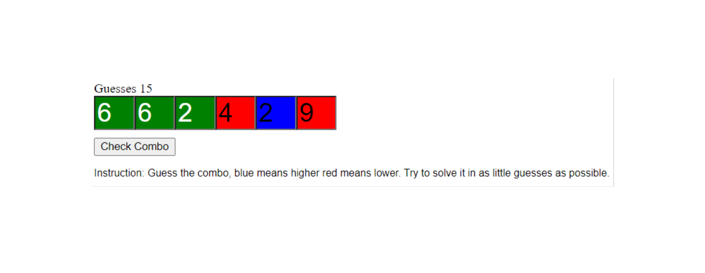

# Combination-Guesser-Game

The objective of the game is to correctly guess the set of six hidden numbers. They are randomly chosen for each game.

# Features

Random values and DOM manipulation:
- Can you guess the secret combination.
- Random combinations.
- Provides feedback when wrong value is selected:
       - Blue guess was low.
       - Red guess was high.
       - Green guess was correct.
- Track guess count.
- No HTML elements all JavaScript created.

# Image

